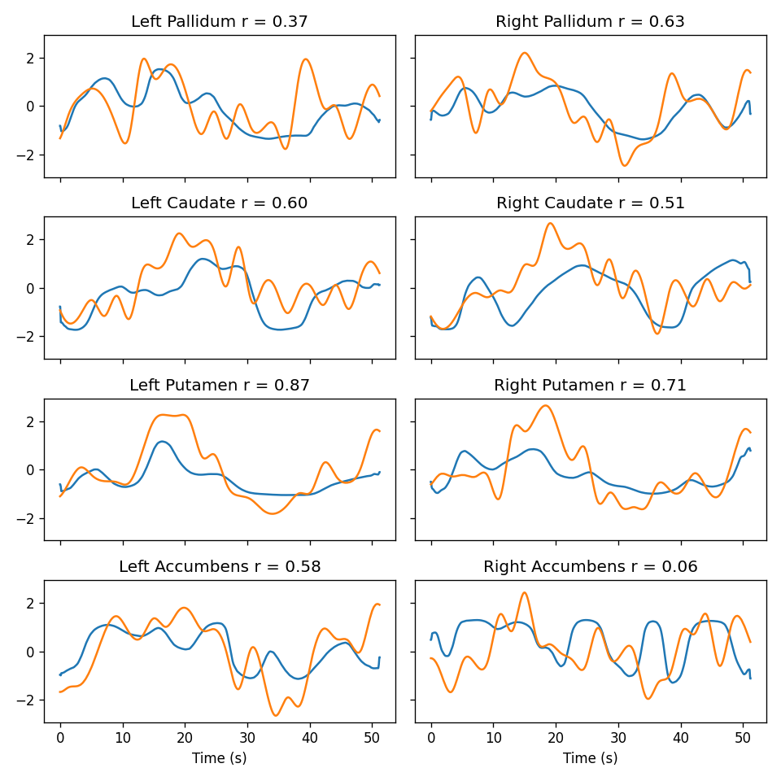
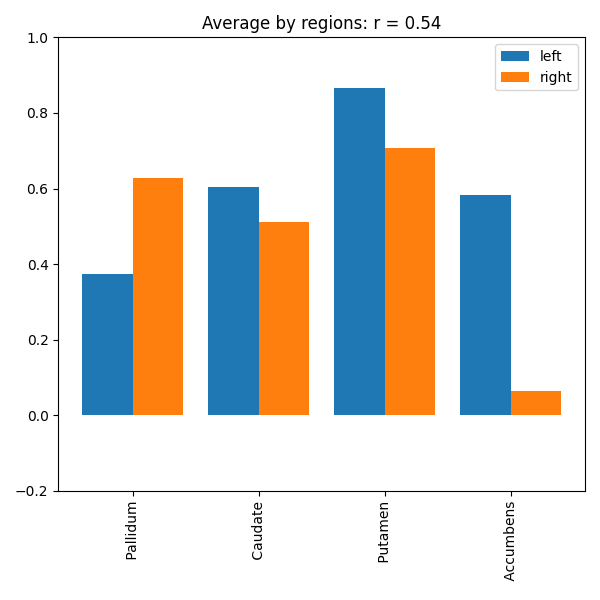

# BEIRA: EEG-to-fMRI Reconstruction with Deep Learning


BEIRA, short for **Brain EEG-fMRI Reconstruction Autoencoder**, is a final-year deep learning project that predicts fMRI region-of-interest activity from EEG time-series signals. It combines EEG preprocessing, fMRI ROI extraction, temporal alignment, PyTorch model training, and inference visualization into one research-oriented machine learning pipeline.

The goal is to explore whether fast, accessible EEG signals can be used to reconstruct slower BOLD activity patterns observed in fMRI.

## Publication

This project is published as a Springer book chapter:

**Deep Learning Model for Decoding Subcortical Brain Activity from Simultaneous EEG-FMRI Multi-modal Data**  
Akash Sasikumar, Divya Sasidharan, V. Sowmya, Vinayakumar Ravi  
In *Machine Learning and Deep Learning Modeling and Algorithms with Applications in Medical and Health Care*, Springer Series in Reliability Engineering, Springer, Cham.

- Published: 01 October 2025
- Pages: 157-185
- DOI: [10.1007/978-3-031-98728-1_9](https://doi.org/10.1007/978-3-031-98728-1_9)
- Springer chapter: [link.springer.com/chapter/10.1007/978-3-031-98728-1_9](https://link.springer.com/chapter/10.1007/978-3-031-98728-1_9)

## Project Snapshot

| Area | What this project demonstrates |
| --- | --- |
| Deep Learning | Built a 1D convolutional autoencoder and multi-head ROI prediction model in PyTorch. |
| Signal Processing | Processed EEG with filtering, rereferencing, temporal alignment, and sliding-window sampling. |
| Neuroimaging | Extracted fMRI ROI signals using Nilearn and Harvard-Oxford atlas utilities. |
| ML Engineering | Created reusable modules for datasets, preprocessing, training, inference, metrics, and visualization. |
| Research Workflow | Used notebooks for experimentation and scripts for repeatable model components. |
| Publication | Published as a Springer book chapter on EEG-fMRI deep learning for subcortical brain activity decoding. |

## Results Preview

The model predicts subcortical fMRI ROI signals from EEG input windows and evaluates them using Pearson correlation.



The ROI-level result summary shows an average regional correlation of approximately **r = 0.54** for the shown run.



## Why This Project Matters

EEG has high temporal resolution but weak spatial localization. fMRI has stronger spatial information but low temporal resolution and higher acquisition cost. BEIRA investigates a machine learning bridge between these modalities by learning EEG-to-fMRI mappings from synchronized recordings.

This project is especially relevant to:

- Brain-computer interface research
- Multimodal biomedical signal modeling
- Deep learning for time-series regression
- NeuroAI and computational neuroscience workflows
- Applied ML pipelines using real scientific data

## Core Features

- End-to-end EEG-to-fMRI reconstruction workflow.
- Interpretable EEG feature block with learnable spatial and temporal filtering.
- 1D convolutional encoder-decoder architecture for sequence reconstruction.
- Multi-head output design for predicting multiple fMRI ROIs.
- CWL dataset loading helpers for simultaneous EEG-fMRI data.
- Temporal interpolation and alignment between EEG and fMRI sampling rates.
- Correlation-based evaluation and visual diagnostics.
- Clean project structure for experimentation, inference, and extension.

## Architecture Overview

```text
Raw EEG + fMRI
      |
      v
Dataset loading and ROI extraction
      |
      v
EEG filtering, rereferencing, interpolation, alignment
      |
      v
Sliding-window PyTorch dataset
      |
      v
Interpretable EEG block
  - spatial unmixing
  - learnable band-pass filtering
  - envelope extraction
  - low-pass filtering
      |
      v
1D convolutional autoencoder
      |
      v
Predicted fMRI ROI time-series
      |
      v
Correlation metrics and visualizations
```

## Model Details

The main model is implemented in [`autoencoder_new_Artur.py`](autoencoder_new_Artur.py).

The model contains:

- **ArturBlock**: a lightweight interpretable EEG front-end.
- **ConvBlock**: temporal convolution, layer normalization, GELU activation, dropout, and downsampling.
- **UpConvBlock**: decoder-side convolution and upsampling.
- **AutoEncoder1D_Artur**: sequence-to-sequence EEG-to-fMRI regression model.
- **AutoEncoder1D_Artur_MultiHead**: multi-head version that predicts each ROI through a separate model head.

## Repository Structure

```text
BEIRA/
|-- autoencoder_new_Artur.py      # Autoencoder and multi-head model definitions
|-- get_datasets.py               # CWL EEG-fMRI loading and ROI extraction helpers
|-- preproc.py                    # EEG/fMRI preprocessing and alignment utilities
|-- torch_dataset.py              # Sliding-window PyTorch dataset wrapper
|-- train_utils.py                # Loss functions, training loop, checkpointing, W&B logging
|-- inference.py                  # Inference metrics and visualization functions
|-- main.ipynb                    # Training and experimentation notebook
|-- BEIRA_Inference.ipynb         # Inference and model interpretation notebook
|-- env_torch.yml                 # Original Conda environment export
|-- requirements.txt              # Lightweight dependency list
|-- plot_ts_image_253_69b84c67c0c86f581cdd.png
|-- bar_plot_253_f233d3df5148bce55c05.png
`-- README.md
```

## Tech Stack

| Category | Tools |
| --- | --- |
| Programming | Python |
| Deep Learning | PyTorch |
| EEG Processing | MNE |
| fMRI / Neuroimaging | Nilearn |
| Data Handling | NumPy, Pandas, SciPy |
| Visualization | Matplotlib, Seaborn |
| Experiment Tracking | Weights & Biases |
| Development | Jupyter Notebook, Conda |

## Dataset Notice

The raw CWL EEG-fMRI dataset and neuroimaging files are intentionally not included in this repository because they are large binary research artifacts. Keep the dataset locally under:

```text
Dataset/
`-- trio1/
    `-- CWL_Data/
```

Expected paths include:

```text
Dataset/trio1/CWL_Data/eeg/in-scan/
Dataset/trio1/CWL_Data/mri/epi_normalized/
Dataset/trio1/CWL_Data/mri/epi_motionparams/
```

For sharing raw data or large checkpoints, use Git LFS, release assets, or external cloud storage.

## Installation

Clone the repository:

```bash
git clone https://github.com/akashsasi/BEIRA-EEG-fMRI-Reconstruction.git
cd BEIRA-EEG-fMRI-Reconstruction
```

Create a Python environment:

```bash
python -m venv .venv
source .venv/bin/activate
```

On Windows:

```bash
.venv\Scripts\activate
```

Install dependencies:

```bash
pip install -r requirements.txt
```

Alternatively, recreate the original Conda environment:

```bash
conda env create -f env_torch.yml
conda activate myenv_torch
```

## How to Run

1. Place the CWL dataset in the local `Dataset/` directory.
2. Open `main.ipynb` to run preprocessing, model setup, training, and validation.
3. Open `BEIRA_Inference.ipynb` to load the trained checkpoint and visualize predictions.
4. Use `inference.py` to compute ROI correlations and generate result plots.

## Evaluation

The project evaluates reconstruction quality with:

- Pearson correlation between predicted and true ROI signals.
- Per-ROI time-series comparison plots.
- Grouped left/right ROI correlation bar charts.
- Mean ROI correlation across selected subcortical regions.

In the included run, several ROIs show strong signal correspondence, including Putamen regions with correlations above **0.70** in the displayed result.

## Key Learning Outcomes

This project strengthened practical experience in:

- Building PyTorch architectures for biomedical time-series data.
- Working with EEG and fMRI preprocessing pipelines.
- Handling multimodal data alignment and sampling-rate differences.
- Designing reusable ML utilities beyond a single notebook.
- Communicating technical research through metrics and visual results.

## Future Improvements

- Add more subjects from the CWL dataset for stronger generalization.
- Compare the autoencoder against Transformer or Temporal Convolutional Network baselines.
- Add automated training configuration files.
- Improve checkpoint handling with Git LFS or release assets.
- Package the preprocessing pipeline into a command-line interface.
